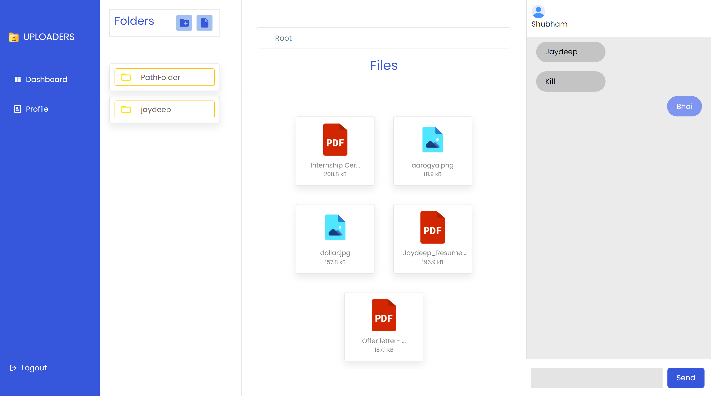
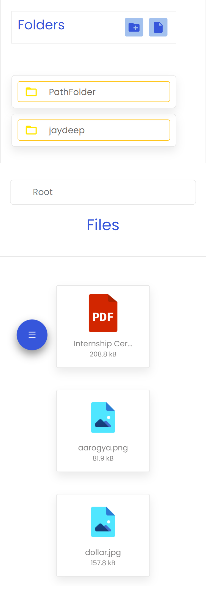

# DevHack22!

  

 

## Web APP made for DevHack22 by Jaydeep Shelake

> WEB TRACK – Build a mobile / web application where students can share their class notes ,
> information regarding classes .

## ⚙️ Detailed Functionality

- User has to authenticate himself by email and password
- After signin/signup user will redirected to dashborad
- User can add files to the dashboard
- Use can create folder and add files and folders in that folder (nested folder and files)
- User can chat with Others
- User can check the size of the uploaded file
- User can see his details in profile section
- By clicking on the file user can view it
- Files are displayed according to their types like pdf and png
- User can logout from application any Time

## 🚀 Tech and Tools Used

- FrontEnd - ReactJS
- BackEnd - Firebase
- RectJS,Context,firebase,CSS,React-Bootstarp, Rect-firebas-hooks...
- VS code
- GitHub

## Video Link: https://drive.google.com/file/d/1zPoG36YLrWjJTahcwXxrNMigISeN9hMO/view?usp=sharing

## 📸 Screenshots

## Desktop View

 

## Mobile View

 

### Deployment Link : https://auth-83ed4.web.app

## Author
Name: Jaydeep Hindurao Shelake
email: jaydeepshelake10@gmail.com
LinkedIn: https://www.linkedin.com/in/jaydeep-shelake-a348771b2/
